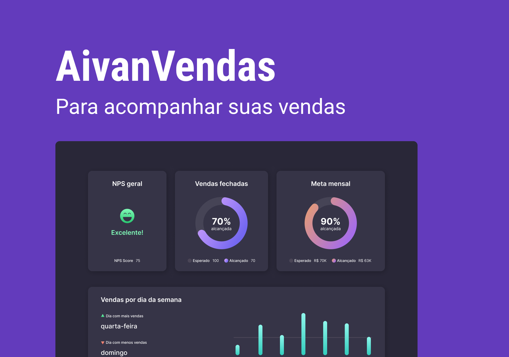

# AivanVendas

O projeto AivanVendas, foi criado com o objetivo de ajudar empresas a acompanhar seus negócios e sua renda mensal.

## Screenshots

## 🛠 Tecnologias
HTML;
CSS;
JS;
GIT E GITHUB;
FIGMA;

## Licença

[MIT License](https://choosealicense.com/licenses/mit/)

## Suporte

Para suporte, mande um email para ivan.rocha.0987@gmail.com ou entre em contato pelo whatsapp (41) 98468-5317.

## Feedback

Se você tiver algum feedback, por favor enviar para ivan.rocha.0987@gmail.com

## Autores

- [@IvanRocha](https://www.github.com/ivanrocha10)

## 🔗 Links

